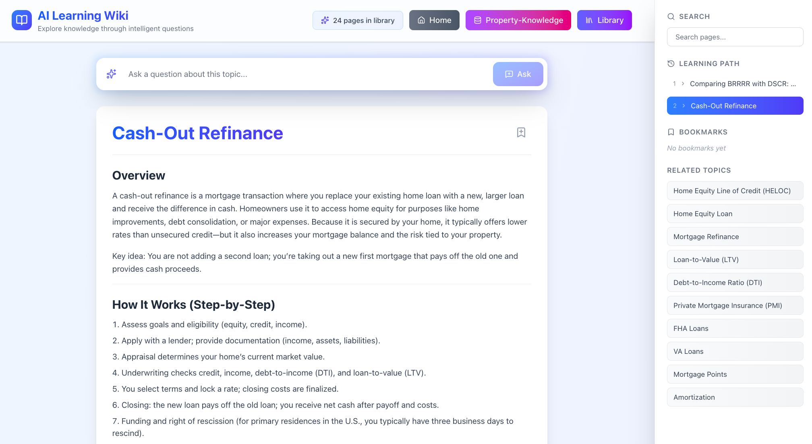

# Wiki de Aprendizaje con IA

[English](README.md) | [繁體中文](README.zh-TW.md) | [简体中文](README.zh-CN.md) | [日本語](README.ja.md) | [한국어](README.ko.md) | [Español](README.es.md)

Una plataforma de aprendizaje moderna, inmersiva y altamente interactiva donde los usuarios pueden explorar conocimientos a través de páginas wiki generadas por IA y preguntas inteligentes.


*Interfaz interactiva de Wiki de Aprendizaje con IA, mostrando la página del tema de Refinanciamiento Cash-Out*

## Características

### Sistema Wiki Dinámico
- Páginas wiki completas generadas por IA con formato enriquecido
- Barra lateral inteligente de "Temas Relacionados" para explorar conceptos conectados
- Enlaces inteligentes y construcción progresiva de conocimiento
- Generación de contenido consciente del contexto

### Interacción Impulsada por IA
- Entrada de preguntas en lenguaje natural en cada página
- Respuestas conscientes del contexto basadas en el tema actual y el camino de aprendizaje
- Sugerencias inteligentes para preguntas relacionadas
- Detección automática de temas existentes vs. nuevos para evitar duplicación

### Experiencia de Usuario
- Guardar sesiones de aprendizaje y bases de conocimiento personalizadas
- Navegación de migas de pan mostrando el historial del camino de aprendizaje
- Marcadores de páginas wiki favoritas
- Búsqueda en todo el contenido generado
- Diseño responsivo optimizado para escritorio y tableta
- Diseño limpio y minimalista con gradientes elegantes y transiciones suaves

### Gestión del Conocimiento
- Estructura de mapa mental en segundo plano organizando el grafo de conocimiento
- Generación de contenido inteligente guiada por la estructura de conocimiento
- Almacenamiento persistente en base de datos SQLite para todas las páginas y sesiones
- Soporte multi-base de datos para organizar diferentes bibliotecas de aprendizaje
- Páginas wiki listas para exportar

## Primeros Pasos

### Requisitos Previos
- Node.js 18+ instalado
- Una clave API de OpenAI de [OpenAI Platform](https://platform.openai.com/api-keys)

### Instalación

1. Clone el repositorio e instale las dependencias:
```bash
npm install
```

2. Configure su API de OpenAI:
   - Copie el archivo de entorno de ejemplo:
```bash
cp .env.sample .env.local
```
   - Edite `.env.local` y agregue su clave API de OpenAI:
```env
OPENAI_API_KEY=sk-your-openai-api-key-here
```
   - Opcional: Personalice el modelo (predeterminado: gpt-5):
```env
OPENAI_MODEL=gpt-4o  # Opciones: gpt-5, gpt-4o, gpt-4o-mini, gpt-4-turbo-preview, gpt-3.5-turbo
```
   - Opcional: Use un endpoint API diferente (para Azure OpenAI u otros proveedores):
```env
OPENAI_API_BASE_URL=https://api.openai.com/v1  # endpoint predeterminado de OpenAI
```

3. Ejecute el servidor de desarrollo:
```bash
npm run dev
```

4. Abra [http://localhost:3000](http://localhost:3000) en su navegador

## Uso

1. **Comenzar a Aprender**: Ingrese cualquier tema en el cuadro de búsqueda para generar una página wiki completa
2. **Hacer Preguntas**: Use la entrada de preguntas para profundizar en cualquier concepto
3. **Explorar Temas Relacionados**: Haga clic en los temas relacionados en la barra lateral o el contenido de la página
4. **Marcar Páginas**: Guarde páginas importantes para acceso rápido más tarde
5. **Seguir el Progreso**: Vea su camino de aprendizaje en las migas de pan de la barra lateral
6. **Buscar**: Encuentre contenido previamente generado usando la función de búsqueda

## Stack Tecnológico

- **Frontend**: Next.js 16, React 19, TypeScript
- **Estilos**: Tailwind CSS 4 con gradientes y animaciones personalizadas
- **Iconos**: Lucide React
- **Markdown**: React Markdown para renderizado de contenido enriquecido
- **IA**: API de OpenAI (soporta GPT-5, GPT-4o, GPT-4o-mini y GPT-3.5-turbo)
- **Almacenamiento**: Base de datos SQLite del lado del servidor con better-sqlite3

## Arquitectura

### Componentes
- `TopicSearch`: Interfaz de entrada de tema inicial
- `WikiPage`: Visualización rica de página wiki con renderizado markdown
- `QuestionInput`: Entrada de preguntas prominente para cada página
- `Sidebar`: Navegación, marcadores y camino de aprendizaje

### Sistemas Centrales
- `lib/ai-service.ts`: Generación de wiki impulsada por IA y respuesta a preguntas
- `lib/storage.ts`: Capa de cliente API de almacenamiento para páginas, sesiones, marcadores y mapa mental
- `lib/db.ts`: Capa de base de datos SQLite con better-sqlite3
- `lib/types.ts`: Definiciones de tipos TypeScript
- `app/api/generate/route.ts`: Endpoint API para generación de contenido con IA
- `app/api/pages/route.ts`: Endpoint CRUD para páginas wiki
- `app/api/sessions/route.ts`: Gestión de sesiones de aprendizaje
- `app/api/bookmarks/route.ts`: Gestión de marcadores
- `app/api/mindmap/route.ts`: Gestión de grafo de conocimiento

### Flujo de Datos
1. El usuario ingresa un tema o pregunta
2. Verifica si el contenido ya existe en la base de datos SQLite vía API
3. Si no existe, genera nuevo contenido vía API de IA
4. Actualiza la estructura del mapa mental para mantener el grafo de conocimiento
5. Guarda en la base de datos SQLite vía API y actualiza la UI
6. Rastrea en la sesión de aprendizaje para navegación

## Personalización

### Configuración de API
Edite `.env.local` para personalizar:
- Selección de modelo: `OPENAI_MODEL` (predeterminado: gpt-5)
  - Opciones: gpt-5, gpt-4o, gpt-4o-mini, gpt-4-turbo-preview, gpt-3.5-turbo
  - Nota: gpt-5 requiere acceso especial de OpenAI
- Endpoint API: `OPENAI_API_BASE_URL` (para Azure OpenAI u otros proveedores)

Edite `app/api/generate/route.ts` para configuraciones avanzadas:
- Temperatura (predeterminado: 0.7 para modelos no GPT-5)
- Tokens máximos de finalización (predeterminado: 16000)
- Formato de respuesta (objeto JSON)
- Tiempo de espera de solicitud (predeterminado: 2 minutos)

### Estilos
- Modifique `app/globals.css` para estilos globales
- Actualice las clases de Tailwind en los componentes para cambios visuales
- Los gradientes usan la paleta azul-índigo-púrpura

### Generación de Contenido
Edite los prompts en `lib/ai-service.ts` para personalizar:
- Estructura y tono de la página wiki
- Sugerencias de temas relacionados
- Estilo de respuesta a preguntas

## Características en Detalle

### Estructura de Conocimiento del Mapa Mental
- Estructura de grafo invisible organizando todos los temas
- Relaciones padre-hijo entre páginas
- Seguimiento de profundidad para jerarquía de conocimiento
- Enlaces inteligentes basados en contexto

### Sesiones de Aprendizaje
- Creación automática de sesión en el primer tema
- Navegación de migas de pan (últimas 10 páginas)
- Seguimiento del conteo de páginas
- Persistencia de sesión en base de datos SQLite
- Sobrevive reinicios del navegador y actualizaciones de página

### Deduplicación Inteligente
- Detección de coincidencia exacta para temas
- Detección de preguntas similares
- Reutilización de contenido existente cuando sea posible
- IDs de página consistentes basados en título + marca de tiempo

## Desarrollo

```bash
# Ejecutar servidor de desarrollo
npm run dev

# Construir para producción
npm run build

# Iniciar servidor de producción
npm start

# Lintear código
npm run lint
```

## Compatibilidad con Navegadores

Navegadores modernos con:
- Soporte JavaScript ES6+
- CSS Grid y Flexbox
- Fetch API
- Recomendado: Última versión de Chrome, Firefox, Safari o Edge

## Licencia

MIT

## Contribuir

¡Las contribuciones son bienvenidas! No dude en enviar un Pull Request.
