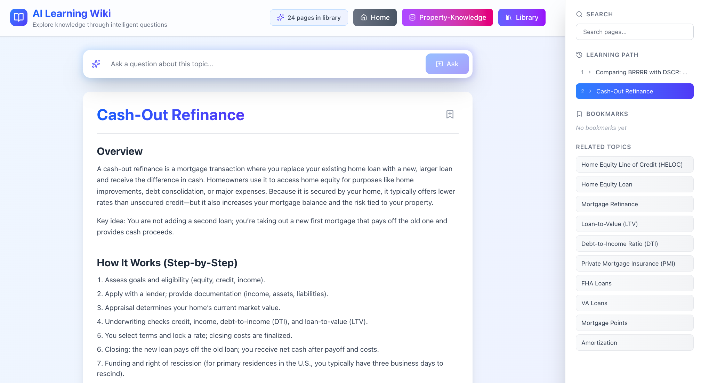

# AI 学習ウィキ

[English](README.md) | [繁體中文](README.zh-TW.md) | [简体中文](README.zh-CN.md) | [日本語](README.ja.md) | [한국어](README.ko.md) | [Español](README.es.md)

AI生成のウィキページとインテリジェントな質問応答を通じて知識を探索できる、モダンで没入感のある高度にインタラクティブな学習プラットフォームです。


*AI 学習ウィキのインタラクティブなインターフェース、キャッシュアウトリファイナンストピックページを表示*

## 機能

### 動的ウィキシステム
- リッチフォーマットのAI生成包括的ウィキページ
- 関連する概念を探索するためのインテリジェントな「関連トピック」サイドバー
- スマートリンクと段階的な知識構築
- コンテキスト認識型コンテンツ生成

### AI駆動のインタラクション
- すべてのページでの自然言語質問入力
- 現在のトピックと学習パスに基づいたコンテキスト認識型の回答
- 関連する質問のスマート提案
- 重複を避けるための既存トピックと新規トピックの自動検出

### ユーザーエクスペリエンス
- 学習セッションとカスタム知識ベースの保存
- 学習パス履歴を表示するパンくずナビゲーション
- お気に入りのウィキページのブックマーク
- 生成されたすべてのコンテンツの検索
- デスクトップとタブレットに最適化されたレスポンシブデザイン
- エレガントなグラデーションとスムーズなトランジションを備えたクリーンでミニマルなデザイン

### 知識管理
- 知識グラフを整理する舞台裏のマインドマップ構造
- 知識構造によって導かれるインテリジェントなコンテンツ生成
- すべてのページとセッションの永続的なSQLiteデータベースストレージ
- 異なる学習ライブラリを整理するためのマルチデータベースサポート
- エクスポート可能なウィキページ

## はじめに

### 前提条件
- Node.js 18+ がインストールされていること
- [OpenAI Platform](https://platform.openai.com/api-keys) からのOpenAI APIキー

### インストール

1. リポジトリをクローンして依存関係をインストールします:
```bash
npm install
```

2. OpenAI APIを設定します:
   - サンプル環境ファイルをコピーします:
```bash
cp .env.sample .env.local
```
   - `.env.local` を編集してOpenAI APIキーを追加します:
```env
OPENAI_API_KEY=sk-your-openai-api-key-here
```
   - オプション: モデルをカスタマイズします(デフォルト: gpt-5):
```env
OPENAI_MODEL=gpt-4o  # オプション: gpt-5, gpt-4o, gpt-4o-mini, gpt-4-turbo-preview, gpt-3.5-turbo
```
   - オプション: 異なるAPIエンドポイントを使用します(Azure OpenAIまたは他のプロバイダー用):
```env
OPENAI_API_BASE_URL=https://api.openai.com/v1  # デフォルトのOpenAIエンドポイント
```

3. 開発サーバーを実行します:
```bash
npm run dev
```

4. ブラウザで [http://localhost:3000](http://localhost:3000) を開きます

## 使用方法

1. **学習を始める**: 検索ボックスに任意のトピックを入力して包括的なウィキページを生成します
2. **質問する**: 質問入力を使用して任意の概念をより深く掘り下げます
3. **関連トピックを探索する**: サイドバーまたはページコンテンツの関連トピックをクリックします
4. **ページをブックマークする**: 後で素早くアクセスするために重要なページを保存します
5. **進捗を追跡する**: サイドバーのパンくずで学習パスを確認します
6. **検索する**: 検索機能を使用して以前に生成されたコンテンツを見つけます

## 技術スタック

- **フロントエンド**: Next.js 16, React 19, TypeScript
- **スタイリング**: カスタムグラデーションとアニメーション付きのTailwind CSS 4
- **アイコン**: Lucide React
- **Markdown**: リッチなコンテンツレンダリングのためのReact Markdown
- **AI**: OpenAI API(GPT-5、GPT-4o、GPT-4o-mini、GPT-3.5-turboをサポート)
- **ストレージ**: better-sqlite3を使用したサーバーサイドSQLiteデータベース

## アーキテクチャ

### コンポーネント
- `TopicSearch`: 初期トピック入力インターフェース
- `WikiPage`: markdownレンダリング付きのリッチなウィキページ表示
- `QuestionInput`: すべてのページの目立つ質問入力
- `Sidebar`: ナビゲーション、ブックマーク、学習パス

### コアシステム
- `lib/ai-service.ts`: AI駆動のウィキ生成と質問応答
- `lib/storage.ts`: ページ、セッション、ブックマーク、マインドマップのストレージAPIクライアント層
- `lib/db.ts`: better-sqlite3を使用したSQLiteデータベース層
- `lib/types.ts`: TypeScript型定義
- `app/api/generate/route.ts`: AIコンテンツ生成のためのAPIエンドポイント
- `app/api/pages/route.ts`: ウィキページのCRUDエンドポイント
- `app/api/sessions/route.ts`: 学習セッション管理
- `app/api/bookmarks/route.ts`: ブックマーク管理
- `app/api/mindmap/route.ts`: 知識グラフ管理

### データフロー
1. ユーザーがトピックまたは質問を入力
2. API経由でSQLiteデータベースにコンテンツが既に存在するかチェック
3. 存在しない場合、AI API経由で新しいコンテンツを生成
4. 知識グラフを維持するためにマインドマップ構造を更新
5. API経由でSQLiteデータベースに保存し、UIを更新
6. ナビゲーションのために学習セッションで追跡

## カスタマイズ

### API設定
`.env.local` を編集してカスタマイズします:
- モデル選択: `OPENAI_MODEL` (デフォルト: gpt-5)
  - オプション: gpt-5、gpt-4o、gpt-4o-mini、gpt-4-turbo-preview、gpt-3.5-turbo
  - 注意: gpt-5にはOpenAIからの特別なアクセスが必要です
- APIエンドポイント: `OPENAI_API_BASE_URL` (Azure OpenAIまたは他のプロバイダー用)

`app/api/generate/route.ts` を編集して高度な設定を行います:
- Temperature(デフォルト: 非GPT-5モデルの場合0.7)
- 最大完了トークン数(デフォルト: 16000)
- レスポンス形式(JSONオブジェクト)
- リクエストタイムアウト(デフォルト: 2分)

### スタイリング
- `app/globals.css` を修正してグローバルスタイルを設定
- コンポーネントのTailwindクラスを更新してビジュアルの変更を行う
- グラデーションは青-インディゴ-紫のパレットを使用

### コンテンツ生成
`lib/ai-service.ts` のプロンプトを編集してカスタマイズします:
- ウィキページの構造とトーン
- 関連トピックの提案
- 質問応答スタイル

## 詳細機能

### マインドマップ知識構造
- すべてのトピックを整理する非表示のグラフ構造
- ページ間の親子関係
- 知識階層の深さ追跡
- コンテキストに基づくスマートリンク

### 学習セッション
- 最初のトピックで自動セッション作成
- パンくずナビゲーション(直近10ページ)
- ページ数追跡
- SQLiteデータベースでのセッション永続化
- ブラウザの再起動やページの更新後も保持

### スマート重複排除
- トピックの完全一致検出
- 類似質問の検出
- 可能な限り既存のコンテンツを再利用
- タイトル + タイムスタンプに基づく一貫性のあるページID

## 開発

```bash
# 開発サーバーを実行
npm run dev

# 本番用にビルド
npm run build

# 本番サーバーを起動
npm start

# コードをLint
npm run lint
```

## ブラウザサポート

以下をサポートするモダンブラウザ:
- ES6+ JavaScriptサポート
- CSS GridとFlexbox
- Fetch API
- 推奨: 最新のChrome、Firefox、Safari、またはEdge

## ライセンス

このプロジェクトはGNU Affero General Public License v3.0（AGPL-3.0）の下でライセンスされています - 詳細については[LICENSE](LICENSE)ファイルをご覧ください。

AGPL-3.0は自由なコピーレフトライセンスで、このソフトウェアの修正版をサーバー上で実行する場合、修正されたソースコードをユーザーが利用できるようにすることを要求します。

## 貢献

貢献を歓迎します!お気軽にPull Requestを提出してください。
